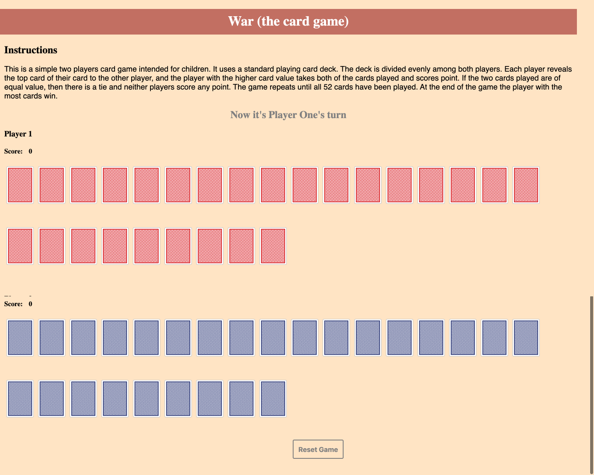

# War (The Card Game)

Created By | Last Updated
-----------|--------------
Salma Khan | November 7, 2019

This is a simple two players card game intended for children. It uses a standard playing card deck. The deck is divided evenly among both players. Each player reveals the top card of their card to the other player, and the player with the higher card value takes both of the cards played and scores point. If the two cards played are of equal value, then there is a tie and neither players score any point. The game repeats until all 52 cards have been played. At the end of the game the player with the most cards win.

## Screenshot of the Game 

## User Stories
* As a player, I should land on the homepage and see the gameboard with the title "War – the card game". All my 26 cards should be upside down on the deck, the scoreboard is cleared to zero, and the gameboard is ready for me to begin the game.
* I should be able to see a message that tells me who's turn it is.
* I should be able to start the game immediately by clicking on a card and see my card flipped over while the scoreboard is calculating my card’s scores. 
* Once the card flips over, the game should automatically switch turns and shows a message that it is 2nd player’s turn. 
* After the 2nd player’s turn, the game should compare card values of both players.
    * If both cards have different values, the player who played the higher value card gets all the point. 
        * The cards that were clicked in the deck, should disappear.
    *  If both cards have the same value, prompt a message saying, “It’s a TIE!” and neither of the player gets any point.
* The game should repeat until all 52 cards disappear from the deck and while players are keeping their scores. 

## Technologies Used: 
* HTML
* CSS 
* CSS flexbox 
* JavaScript 
* JS DOM  

## Next Steps...
This game can be enhanced by making the following changes:
* Make it a 3 players game
* Use animation and sound affects when cards are flipped 
* The tie stage of the game can be more complicated. For example, in the tie stage each player can flip three cards instead of one and the          player with higher value cards flipped gets all the points. 
* The congratuatory winning message can have animation and sound affect. 

## Link To Play The Game
[Click Here](https://ssahussai.github.io/War-the-card-game/) 

